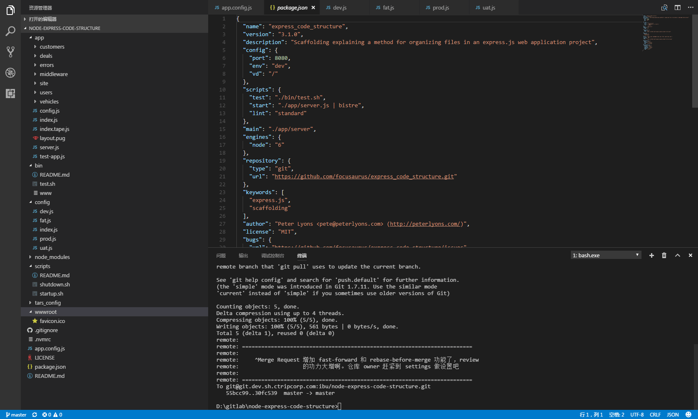

# 基于Express的Web项目实践

## 先看截图吧，这是一个基于Express的中型Node项目。


*这是一个真实在线上运行项目的大致目录*

## 项目结构
```shell
├── app  
│   ├── fonts  
│   ├── ├── ...
│   │   └── ...
│   ├── img
│   ├── ├── ...
│   │   └── ...
│   ├── middlewares
│   │   └── ...  
│   ├── routes
│   ├── ├── ...
│   ├── views
│   │   ├── ...
│   │   ├── index.js
│   │   ├── index.tap.js       // 单元测试
│   │   └── template.js
|   ├── config.js
│   └── server.js               // server启动入口
├── bin
│   └── wwww                    // 项目启动
├── config                      // 各环境配置项
│   ├── dev.js                  // 开发环境
│   ├── fat.js                  // fat测试环境
│   ├── index.js                // 环境配置读取入口
│   ├── prod.js                 // 生产环境
│   └── uat.js                  // UAT测试环境
├── scripts  
│   ├── shutdown.sh             // 生产环境关闭应用sh
│   └── startup.sh              // 生产环境启动应用sh
├── tars_config                 // 生产环境配置
│   └── ... 
├── wwwroot                     // 静态文件目录
│   └── ...                     // 静态文件
├── app.config.js               // 应用配置
├── package.json
├── README.md
├── .git
├── .gitignore
└── .nvmrc                       // 指定node版本
```

## 代码划分的基本原则和动机
- 可轻松管理
  * 我们的大脑适合处理少量有关联性的东西，所以我们使用了目录。它帮助我们集中处理每个小部分文件从而降低复杂性。
- 尺寸合适
  * 不要创建仅有一个文件的大目录。一个目录下至少放3个文件才是合适的。如同我们不需要开公交车去上班，开个小汽车就好了。因此请通过判断实际的文件数来决定是否需要创建一个文件夹。
- 恰当的模块化
  * Node社区几乎都是崇尚小模块的。但是对于一个中型应用而言，这种分离成小模块的时间开销并不会获得相应的价值体现。
- 容易定位代码
  * 开发一个功能或者修复一个bug时，我们的目标是让开发者可以轻松的定位源文件
  * 命名是准确且有意义
  * 无用的代码请完全移除掉，不要留在一个单独的文件或者仅仅注释掉
- 搜索友好
  * 所有的源代码都放在第一个位置的app目录下，你可以通过cd命令就可以轻松找到
- 简明的命名
  * 现在npm似乎要求所有的包使用小写命名了。文件名使用`kebab-case`方式命名，变量使用`camelCase`方式命名，因为`-`这个符号在javascript语言中代表减号。
  * 变量名称匹配模块路径的基础名称,同时`kebab-case`会转换为`camelCase` 
- 在代码旁边写上测试
  * 把测试写在代码旁边的同级目录中确实有好处，避免了"../../.."这样的路径引用，但个人认为还是要借助测试框架来完成测试工作，例如Mocha。
- 通过事件减少交叉耦合
  * 为了不使你的业务代码看起来像一团乱麻，必要的事件回调还是非常好的，尽量降低交叉引用，使你的模块保持独立。
- 代码流畅
  * `app/server.js`是应用启动的唯一入口。
  * 不要使用 DSLs(声明式语言) 作为路由，避免非必要的元编程.（PS: 过渡的封装是不好滴）
  * 不要使用 app.all 来代替 app.get\app.put\app.delete, 这无疑会使程序变得更复杂，需要更多的判断。
- 使用`lower-kebab-case`命名文件
   * 这种方式可以避免跨平台时的文件系统大小写敏感问题
   * npm禁止在新包名称中使用大写，目前这点工作得很好

## 说了这么多，还是看看源代码吧
[源代码git地址](https://github.com/StevenX911/express_code_structure)