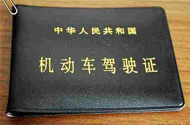
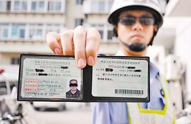
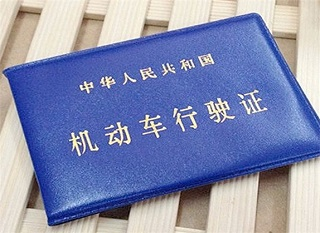
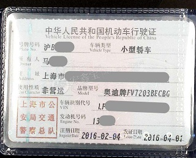
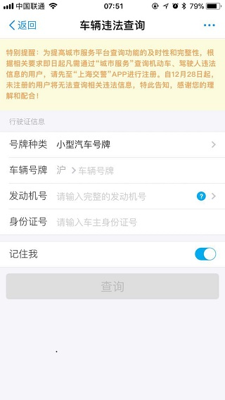
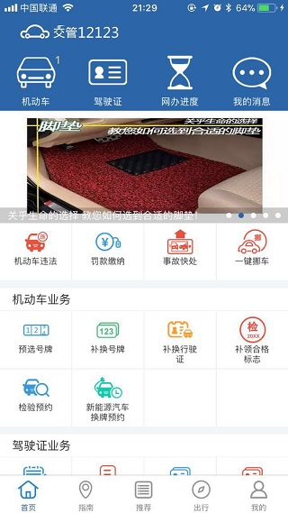
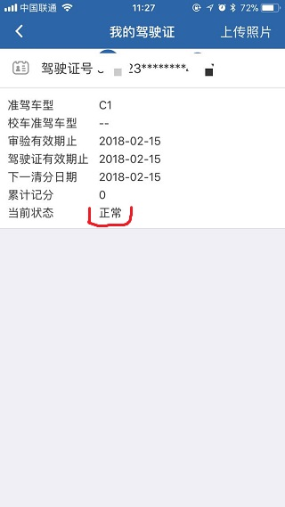
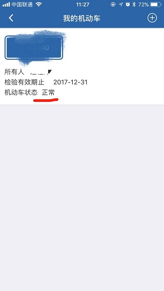

# 关于驾驶证、行驶证及其违章处理

#### 驾驶证

驾驶证全称为机动车驾驶证，又作“驾照”，依照法律机动车辆驾驶人员所需申领的证照。

#### 行驶证

机动车行驶证是准予机动车在我国境内道路上行驶的法定证件。行驶证由证夹、主页、副页三部分组成。其中主页正面是已签注的证芯，背面是机动车相片，并用塑封套塑封。副页是已签注的证芯。

#### 电子违章

利用电子警察，即道路摄像头，拍下的行车违章行为，这种违章与`驾驶车辆绑定`，通常我们通过支付宝等第三方平台，然后输入`车牌号`、`发动机号`查询违章，并且缴纳罚款。

#### 现场处罚

行车时违章被交警当场拦下，交警拿了你的驾照和身份证等信息进行现场处罚，注意`这种违章与驾驶员本人绑定`，也可以称为`驾驶证违章`或者`驾照违章`，此类违章通常我们在支付宝等第三方平台通过`车牌号`、`发动机号`是查询不到的，极容易造成违章处理逾期，此时，我们需要及时根据违章罚单上的违章编号（即条形码下那一串数字）去工商银行缴纳罚款，自助或者柜台均能办理。

> 这种违章在`交管12123`上不能办理，会报`支付格式不正确`或`决定书格式不正确`等错误。

#### 交警12123

推荐这个网站(http://sh.122.gov.cn/)，交管部门官方综合管理平台，看域名就知道是政府的网站，它有个对应的APP，注册绑定驾驶人信息（驾驶证和行驶证），在里面可以看到车辆违章和驾驶人违章。

> 车辆违章未处理会影响车辆年检，驾照违章未处理会影响驾照年检（即期满重新换证）

