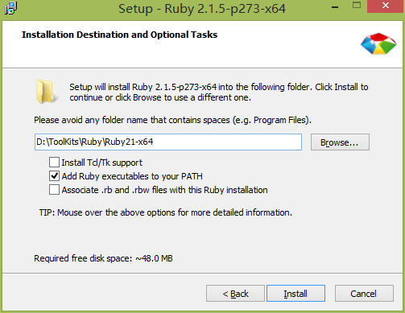
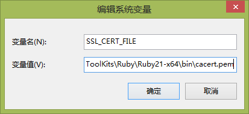

# [环境搭建]Windows下安装Ruby和Jekyll

Jekyll是一款静态网站生成工具，允许用户使用HTML、Markdown或Textile通过模块的方式建立所需网站，然后通过模板引擎Liquid（Liquid Templating Engine）来运行或者生成对应的静态网站文件. 

在GitHub上使用较多，通过GitHub搭建自己的博客一般来说就是使用Jekyll；因为GitHub的渲染引擎默认为Jekyll。

网上很多类似的安装教程，但是一般来说都是需要安装Python，在本篇文章中我们不使用“Pygments”代码高亮引擎，所以不需要安装Python。

#### 安装 Ruby

Jekyll是一款基于Ruby的插件，安装Ruby是必须的. 
1. 下载，传送阵：http://rubyinstaller.org/downloads/ 
2. 点击版本并下载，这里我下载的是：“Ruby 2.2.1 (x64)” 
3. 点击进行安装，此时需要注意两点： 
    - 安装目录不允许包含空格 
    - 选中“Add Ruby executables to your PATH”这样将自动完成环境变量的配置。 
4. 完成后进入“CMD”输入“ruby -v”如显示版本则代表安装成功。



#### 安装 DevKit

DevKit 是一个在 Windows 上帮助简化安装及使用 Ruby C/C++ 扩展如 RDiscount 和 RedCloth 的工具箱。
更多详细的安装指南请查看Ruby的 wiki 页面 阅读。

1. 前往 http://rubyinstaller.org/downloads/

2. 下载与 Ruby 版本相对应的 DevKit 安装包。 例如：“DevKit-mingw64-64-4.7.2-20130224-1432-sfx.exe” 
版本对应关系：

    Ruby 1.8.7 and 1.9.3: 
    DevKit-tdm-32-4.5.2-20111229-1559-sfx.exe

    2.0 and 2.1 (32bits version only): 
    DevKit-mingw64-32-4.7.2-20130224-1151-sfx.exe

    2.0 and 2.1 (x64 - 64bits only) 
    DevKit-mingw64-64-4.7.2-20130224-1432-sfx.exe

运行文件选择解压目录，如“D:\ToolKits\Ruby\DevKit”

解压完成后，通过初始化来创建 config.yml 文件。在命令行窗口内，输入下列命令：

```shell
cd "D:\ToolKits\Ruby\DevKit"
ruby dk.rb init
notepad config.yml
```

此时已经使用记事本打开所创建的”config.yml”文件，于末尾添加新的一行: “- D:/ToolKits/Ruby/Ruby21-x64“，这里的目录为你的Ruby的安装目录，保存文件并退出。

回到命令行窗口内进行安装。
```shell
ruby dk.rb install
```

#### 安装 Jekyll

首先确保 gem 已经正确安装
```shell
//命令输入
gem -v
//输出
2.2.2
```

安装 Jekyll

```shell
//命令行执行
gem install jekyll
```

错误 
在这里或许你将遇到一定的问题，比如：
```shell
ERROR: Could not find a valid gem ‘jekyll’ (>= 0), here is why: 
Unable to download data from https://rubygems.org/ - SSL_connect returned=1 errno=0 state=SSLv3 read server certificate B: certificate verify failed (https://api.rubygems.org/latest_spece.4.8.gz)
```
这个错误的原因是因为证书问题，简单的解决办法为：下载最新的证书，放到指定文件夹，并配置环境变量。

下载：http://curl.haxx.se/ca/cacert.pem 
拷贝到：Ruby安装目录下的“bin”文件夹下 
环境变量： 


至于其他错误，比如443错误，这个多访问几次，或者挂上VPN进行，多尝试几次就OK。

#### 安装 bundler
```shell
//命令行 Gem 安装
gem install rouge
```
